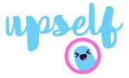

# Upself
Upself presents a friendly chatbot AI called Upsy with a simple goal *Make your day better!*
Upsy is programmed to handle statistically significant psychological tests to help you understand and measure how you are feeling. It's also packed with some cool question-answers datasets to make the interaction more fun.

https://upself-web.herokuapp.com/

# Technology Used

# Keywords
Self help, Artificial Intelligence, Data Science, Neural Networks, Applied Mathematics, Cognitive Behavioral Therapy (CBT), Mental Health First Aid, Columbia University.

# Our team
    Emily Baumgartner.

    Esther Lee.

    Matt Gilliland.

    Rodrigo Costa.
